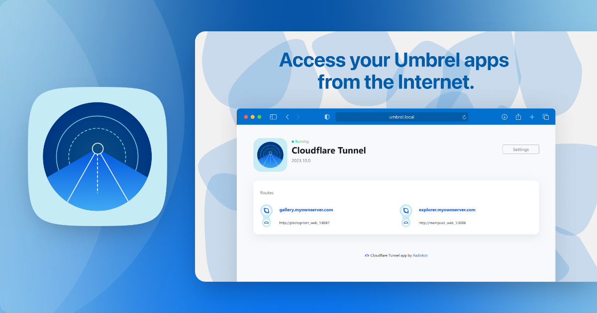
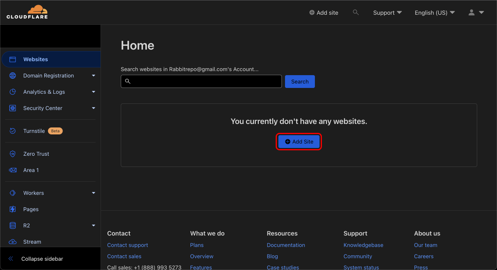
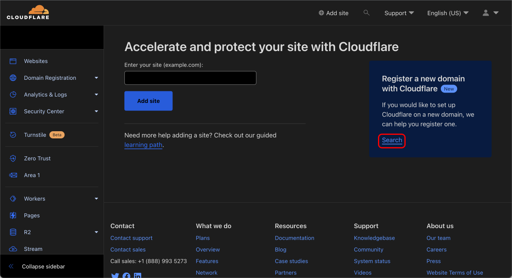
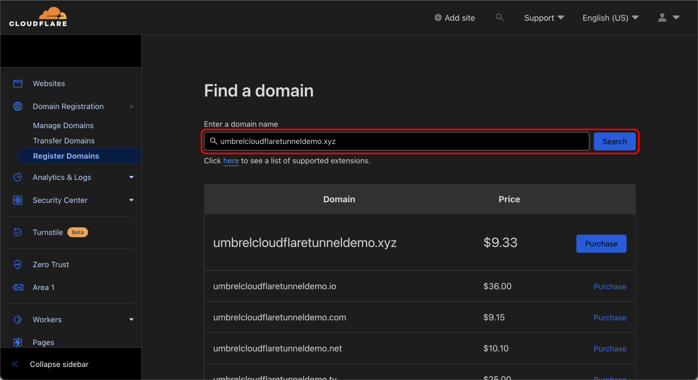
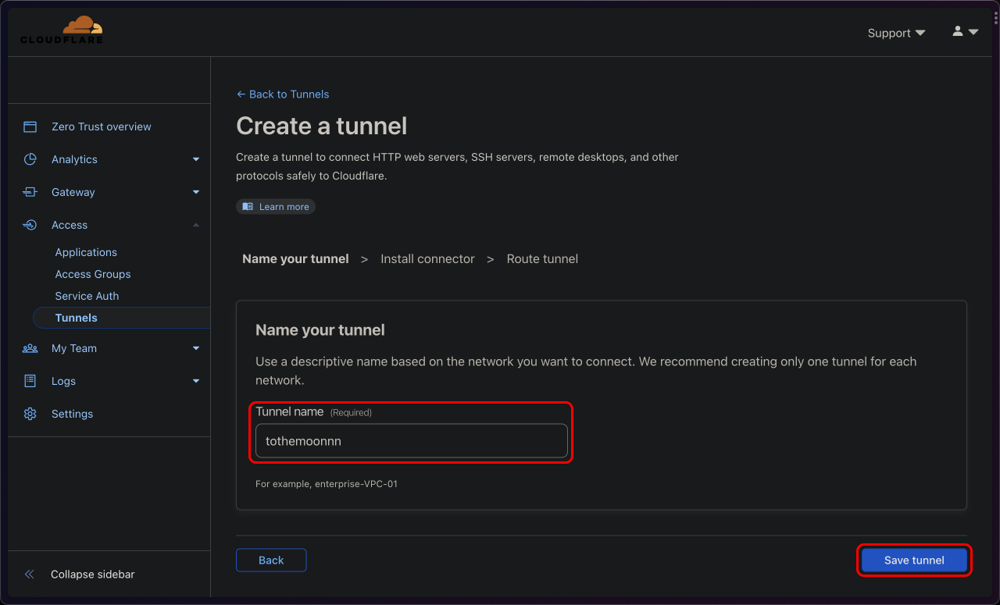
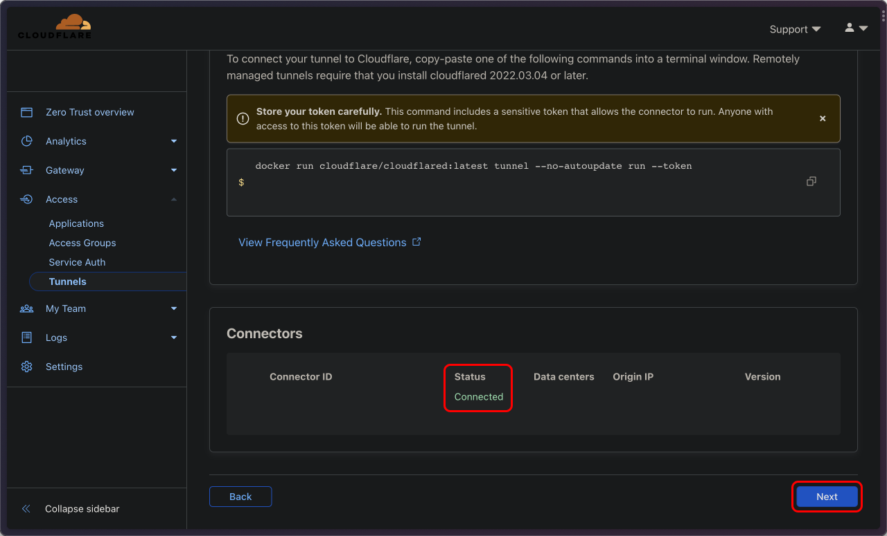
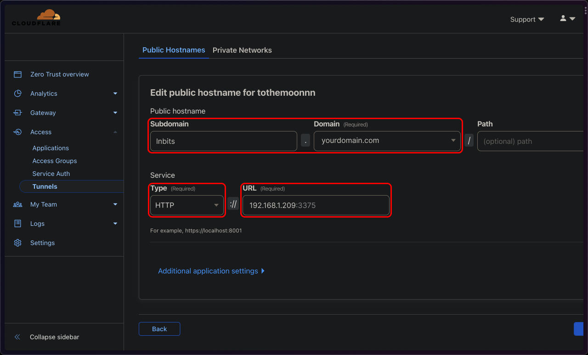
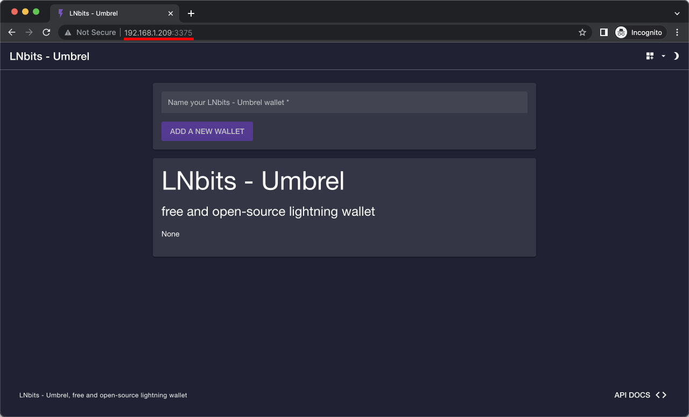
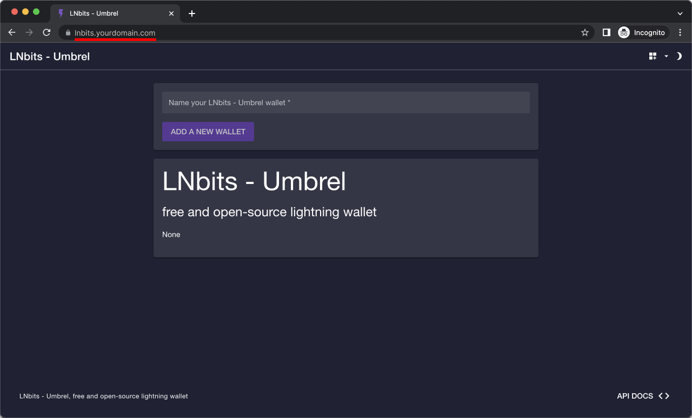

# Make **Umbrel Apps** Public using **Cloudflare Tunnel**

[**Umbrel**](https://umbrel.com/) is one of the easiest ways to start your self-hosting journey. One command installation, a beautiful dashboard, and the app store make it friendly to not-tech-savvy person. 

<br />

<a href="https://umbrel.com">
    
</a>
<p align="center">Image Source: Umbrel</p>


<br />

However, by default, [**Umbrel Apps**](https://apps.umbrel.com) can be accessed only via Tor or VPN (Tailscale).

There might be some use cases that require [**Umbrel Apps**](https://apps.umbrel.com) to be available on the publicly accessible internet. For examples:   

- [LNBits](https://lnbits.com/): On-boarding your family with Lightning Wallet that you manage the liquidity for them. Asking them to use Tor or open Tailscale before using the wallet all the time would be a big friction.

- [NextCloud](https://nextcloud.com/): Accessing NextCloud via Tailscale hurt upload speed. Accessing NextCloud via Tor is not convenient. Tor is also super slow.

For these use cases, **it's better to have your Umbrel Apps accessible via your domain**, and using [**Cloudflare Tunnel**](https://www.cloudflare.com/products/tunnel/) is the easiest way to do that. 

<br />

---

## What is [**Cloudflare Tunnel**](https://www.cloudflare.com/products/tunnel/) ?

Cloudflare Tunnel is a service that allows you to securely expose your locally hosted web application or service to the internet. It works by creating a secure tunnel between your local server and a Cloudflare server, which acts as a proxy, allowing traffic to flow securely between the two.

Traditionally, to expose your locally hosted application to the internet, you would need to open a port on your router and forward traffic to your local server. This method, known as port-forwarding, can be risky as it exposes your local server directly to the internet, potentially leaving it vulnerable to attacks. It also leaks your real IP address which means everyone knows your physical location, making you vulnerable to [**5-dollar-wrench-attack**](https://bitcoinmagazine.com/culture/the-5-wrench-attack-and-your-bitcoin-stack).

Cloudflare Tunnel provides a more secure alternative by encrypting traffic between your local server and the Cloudflare server, which acts as a buffer between your server and the public internet. This means that traffic flows through the Cloudflare network, which provides additional security features like DDoS protection and firewalling.

Overall, Cloudflare Tunnel offers a safer and more secure way to expose your local web application or service to the internet, compared to traditional methods like port-forwarding. It is also easier to set up. You don't need to mess with your router configuration. 

<br />

---

## Tutorial

**January 2024 update:** Now there is a [Cloudflare Tunnel app](https://apps.umbrel.com/app/cloudflared) the Unbrel store providing simple configuration and dashboard UI. You can proceed with the following guide and use this app instead of configuring the daemon through SSH.



<br />

### 1. Sign up for a free Cloudflare Account 

- Go to  https://www.cloudflare.com/ and sign up. Don't forget to verify your email address

<br />

### 2. Get your domain

- Go to https://dash.clodflare.com/ and click **"Add Site"**
    
- Click **"Search"**
    
- Search for your desired domain, and then purchase it
    

<br />

<details>
<summary>if you want to use your existing domain</summary>

<br />

- You need to set Cloudflare as a name server. Here's a great [**video tutorial (4.09-5.20)**](https://youtu.be/ey4u7OUAF3c?t=249) from NetworkChunk.

</details>

<br />

### 3. Set-up Cloudflare Tunnel

- Go to https://dash.cloudflare.com, click **"Zero Trust"** at the left navbar
- Go to **"Access"** then **"Tunnel"**
- Click **"Create a tunnel"**, give it a funny name, then click **"Save tunnel"** 
    
- Choose **"Docker"**, you'll found a command like this

    ```bash
    docker run cloudflare/cloudflared:latest tunnel --no-autoupdate run --token ...
    ```

    We will add 2 things
    - **"-d"** makes it runs in the background
    - **"--restart unless-stopped"** so, when you restart your machine, it will automatically starts

    <br />
    So, the modified command is 

    ```bash
    docker run -d --restart unless-stopped cloudflare/cloudflared:latest tunnel --no-autoupdate run --token ...
    ```
- Run the modified command on your Umbrel machine
- Scroll down and make sure Connectors status is **"Connected"**, then click **"Next"** 
    
- Select your domain (sub-domain is optional), set type to **"HTTP"**, then put **"local-ip:port"** of the app you want to make public in the URL.
    

    <details>
    <summary>
    What is "local-ip:port" ?
    </summary>

    <br/>

    - "local-ip" is the local IP address of your Umbrel machine. It will look like
    
        ```
        192.xxx.x.x  
        ```
        
        <details>
        <summary>
        I don't know the local IP of my Umbrel machine. 
        </summary>

        </br>

        Go to Terminal, run **"ifconfig"**, or here's [**video tutorial from @codefixx**](https://www.youtube.com/shorts/7PZuOnKE7JY)

        </details>
    
    </br>

    - "port" is the port that your selected Umbrel app is using. You can find it on the URL bar when you're using that app. 
    
        

        I'll use LNBits as an example. In this case, the local IP is **"192.168.1.209"** and LNBits is using port **"3375"**.
    
    
    </details>

<br/>

- It's done! You can now access that app from your domain. Easy, right?

    

<br />

---

## Limitations

1. LND still using Tor only. So, the performance is not the best. This configuration is suitable for non-intensive use. Let's say running a small e-commerce website with 10s transactions per day, this configuration works just fine.

For more intensive usage of LND please consider [**configuring hybrid mode on LND**](https://community.getumbrel.com/t/lnd-tor-clearnet-how-to-setup-hybrid-mode/6133).

2. The thing to note is that Cloudflare seems to limit the file size uploaded through them. I tried to upload a big video using this configuration, but it does not work that well. Other than that, if the app does not need a big file upload, it works very well. 

Happy Self-hosting!
